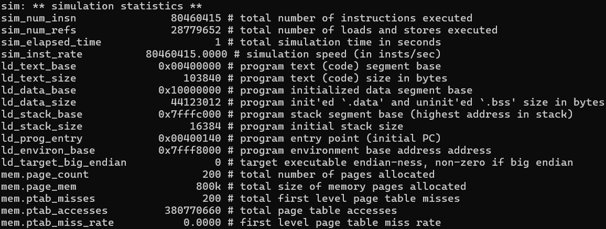
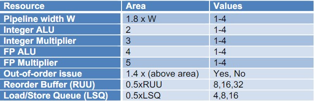
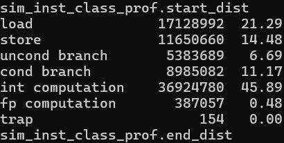
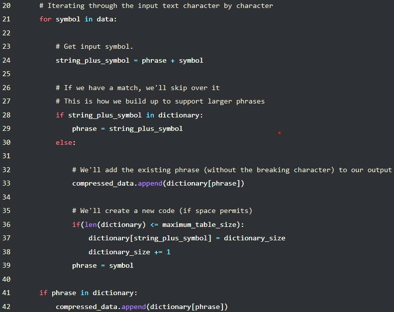

## Assignment 1

Xiao Zhehao, A0235422N

Benchmark: compress

In this assignment, I used SimpleScalar, a simulation software for RISC computer architecture to deepen my understanding of ILP.
Based on my student number, I will be working on the compress benchmark.

First, to validate that my benchmarks are running correctly, I used `srun sim-safe benchmarks/compress95.ss < benchmarks/compress95.in > benchmarks/compress95.out` to obtain the below results, from which I could assertain that my benchmark was running without issue.



### Question A:
The goal of this part is to design the best performing architecture under the constraint that the area of the processor is less than or equal to 60, based on the constraints listed below.


In this question, I assume best performance to be referencing the IPC of the current architecture. The higher the IPC the better the performance. For the rest of the question, unless otherwise specified, I will use the code snippet given below to run my simulations, with <CONFIG_FILE> being the specific config file used for that simulation.

```` bash
srun sim-outorder -config <CONFIG_FILE> benchmarks/compress95.ss < benchmarks/compress95.in > benchmarks/compress95.out
````

First, I wanted to get a sensing of the current and best IPC values i could get. Thus, I ran the compress benchmark with the default configuration with area of 106.08, as seen below, to obtain an IPC of 1.6364. 

| Resource | P. Width | Int ALU | Int Mult | FP ALU | FP Mult | Out-of-order Issue | RUU | LSQ |
| - | - | - | - | - | - | - | - | - |
| Value | 4 | 4 | 1 | 4 | 1 | T | 16 | 8 |
| Area | 7.2 | 8 | 3 | 16 | 5 | 54.88 | 8 | 4 |

I also wanted to know the minimum IPC possible so i ran it with the minimum configuration with an area of 15.8 and got an IPC of 0.6634.

As seen, the area for the default configuration is too large, hence we have to decrease it to below 60 whilst minially affecting our IPC performance.

To do so, we have to understand the profile of our program, mainly the frequencies of instruction classes being run. Hence, we use the command `srun sim-profile -iclass benchmarks/compress95.ss < benchmarks/compress95.in > benchmarks/compress95.out` below to obtain the summary seen below.



As seen from the summary above, there are almost no floating point operations. Hence, I hypothesise that reducing our floating point resources to the minimum will have almost no effect on our IPC performance. To test this, I used the default configuration with both the FP ALU and FP Multiplier values set to 1 against them set to 4 got an IPC values of `1.6362` and `1.6380`. As such, we can run with the reasonable assumption that floating point resources will not affect our IPC performance and hence they can always be set to 1 to minimise their area cost.

From the instruction class distribution, I predict that we will need out-of-order execution as load/store operations have a long downtime on average, so having the ability to move forward with other non true dependent instructions would greatly help our IPC. As such we should see out-of-order execution with a decently sized Load/Store Queue and Reorder Buffer in our ideal solution. In addition, since both the load/store operations and integer computation use the integer ALU, it will be more favoured than the integer multiplication unit in our ideal solution.

In total, there are `4 * 4 * 4 * 4 * 4 * 2 * 3 * 3 = 18432` possible combinations of the resource values. Using our assumption above on floating point resources, we have `4 * 4 * 4 * 1 * 1 * 2 * 3 * 3 = 1152`. Upon testing with sim-outorder, I realised that `-commit:width`, which is part of the pipeline width, can only take in values that are powers of 2. This restricts our values of pipeline width to 3 values and a total of `864` states. Of those states, only `470` states have area less than the maximum allowed of `60.0`.

However, `470` is still too large a number to be iteratively tested to find the best configuration. Hence, we have to make another assumption. If every value in config A is larger than or equals to their respective counterparts in config B, we say that config A is more optimal than config B. If no config is more optimal than config A, we say it is an optimal config. We assume that any optimal config will have an equal or faster IPC as compared to any config which is less optimal than it. Hence, this narrows us down to just `13` optimal states.

With this, we can iteratively test the 44 states with a python script. All calculations and testing mentioned above can be found in the attached python script `1_tester.py`. based on the tests, the best configuration is given below, with an area of 59.04 and an IPC of 1.186. 

| Resource | P. Width | Int ALU | Int Mult | FP ALU | FP Mult | Out-of-order Issue | RUU | LSQ |
| - | - | - | - | - | - | - | - | - |
| Value | 2 | 2 | 1 | 1 | 1 | T | 16 | 8 |
| Area | 3.6 | 4 | 3 | 4 | 5 | 27.44 | 8 | 4 |

Looking at the results, it matches our inital prediction quite well. Of the four operating units, Integer ALU is favoured the most due to its frequent usage and there is a decently sized Reorder Buffer and Load/Store Queue for out-of-order execution. In addition, we also see that the pipeline width is increased to handle 2 instructions per cycle, this can be explained by the fact that integer computation is quite fast in our integer ALUs, hence increasing the pipeline width can significantly benefit our instruction throughput and hence IPC overall.

### Question B:
In this question, we are asked to find the most efficient, highest performance per watt processor, with the same max area constraint of 60.0. In this question, we assume wattage is directly proportional to the area of the processor, so essentially we are asked to find the processor with the highest IPC/area. As such, our initial setup will be quite similar to that of Question A. However, one of our main assumptions of optimality does not hold true anymore. Our highest performing processor from the previous round has an IPC/Watt of `1.186 / 59.04 ≈ 0.0201` whilst our worst performing processor, from our minimum config has a n IPC/Watt of `0.6634 / 15.8 ≈ 0.0420`. It almost seems like there is an inverse relationship between the performance in the previous round and that of this round as area grows much faster than IPC for our processors.

Hence, for this case, we use our python script in `2_tester.py` to test all `470` constrained combinations, same as that we obtained in Question A. In our results, we find that the most efficient processor is actually our minimum configuration processor at `0.0420` IPC/Watt.

### Question C:
For this part, based on our best performing processor in Question A, we need to optimise the number of sets allocated to instruction vs data in our L1 cache based on the alloted configurations below.


Thinking on our compress benchmark, it generates an in-memory buffer of data, compresses it to another in-memory buffer, then decompresses it, using the compression algorithm(LZW) from an old UNIX utility of the same name, according to [this](https://courses.cs.washington.edu/courses/cse471/08sp/hw/benchmark-guide.pdf) guide. Looking at [this](https://aryamansharda.medium.com/implementing-unixs-compress-b715246f0c75#:~:text=The%20Lempel%20Ziv%20Welch%20%5BLZW,where%20no%20data%20is%20lost) sample implementation of the LZW algorithm, we can see that the entire compression loop can be implemented in around 12 lines of code in python without any calls to very complex functions. 



Although not the exact code used in our benchmark, it is reasonable to infer from the above that during each each compression / decompression stage, the program loops through relatively few lines of code for many iterations whilst parsing alot of data. Hence, my inital assumption would be that there would be alot more sets allocated to data as compared to instruction in the l1 cache for the ideal configuration, which would probably be configuration 6 or 7.

Using our code in `3_tester.py`, we can test each configuration and get the results. The code is similar to that used in the previous questions but alot simpler, with the variables in the previous questions fixed into a `optimal.cfg` config file. `cache:dl1` and `cache:il1` are modified to test the configurations instead. Based on our tests, we get the following results and see that the configuration with 128 sets of data and 128 sets of instruction in has the best IPC of `1.6364`.

| Config | 1 | 2 | 3 | 4 | 5 | 6 | 7 |
| - | - | - | - | - | - | - | - |
| dl1 | 1024 | 512 | 256 | 128 | 64 | 32 | 16 |
| il1 | 16 | 32 | 64 | 128 | 256 | 512 | 1024 |
| IPC | 1.359 | 1.5206 | 1.593 | 1.6364 | 1.3278 | 1.2693 | 0.9546 |

This result was rather different from my initial predictions. However, after carefully analysis it also makes sense. First we have to understand that cache size only affects performance up to the size of the working set(the set of data/instruction currently being used). If the whole working set can be stored in the cache, any further increases in cache size will only serve to slow down access to the cache and not provide any benfits. If the working set cannot fit on the cache, then increasing it would significantly increase our performance. By running further tests below, we can see that 128 sets is enough to cover the entire working set of instructions, as halving its size significantly impacts performance whilst doubling its size does not improve performance much. However, we can tell that 128 sets is not enough to cover the data working set as doubling its size provides significant performance gains. However, in the seven configurations above, doubling the number of data sets incurs the cost of halving the instruction set. As mentioned algorithm analysis above, the instructions looped at high frequencies so repeated cache misses would greatly affect performance. Hence, it is safe to reason that 128 sets each of data and instruction cache lines is a good balance of keeping data and instruction cache lines, which results in the best IPC value.

| Config | Less Data | More Data | Less Instructions | More Instructions |
| - | - | - | - | - | - | - | - |
| dl1 | 64 | 256 | 128 | 128 |
| il1 | 128 | 128 | 64 | 64 |
| IPC | 1.59 | 1.6745 | 1.3057 | 1.6396 |